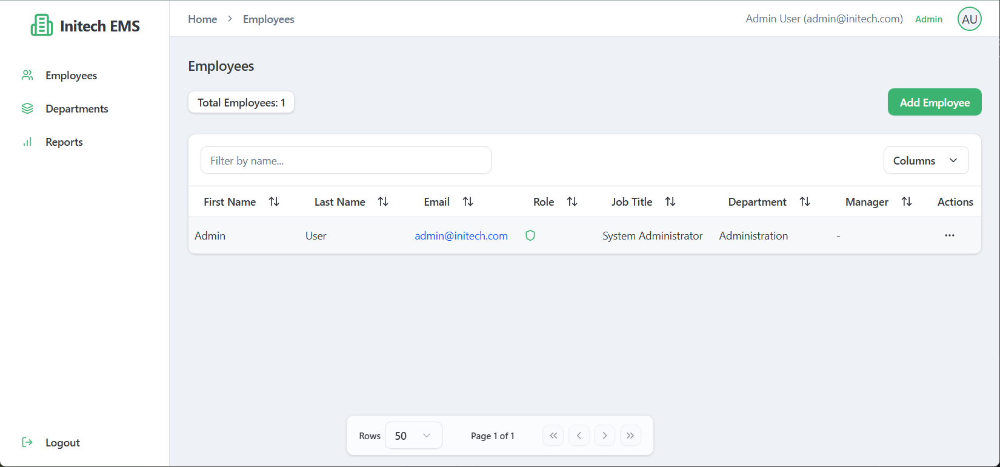

# Initech Employee Management System (EMS)

A full-stack web application for managing employees and departments with role-based access control.



## Overview

Initech EMS is a modern web application that allows organizations to manage their employee hierarchy and departmental structure. The system features JWT-based authentication, role-based access control, and a responsive UI.

## Features

- **User Authentication**: Secure login with JWT tokens and encrypted passwords
- **Role-Based Access Control**: 
  - ADMIN: Full system access
  - EMPLOYEE: Can only view themselves
- **Employee Management**: Create, view, update, and delete employee records
- **Department Management**: Organize employees by department
- **Search & Filtering**: Find employees by name, department, or other attributes
- **Data Validation**: Input validation ensures data integrity
- **Reporting**: View employee and department data in tabular format with timestamps
- **Responsive Design**: Modern UI that works across devices

## Architecture

The application follows object-oriented design principles with proper separation of concerns:
- Service interfaces with specialized implementations
- Entity models with encapsulated data
- Component-based frontend architecture

## Data Model

### Department
- ID (Primary Key)
- Name (Unique)
- Description

### Employee
- ID (Primary Key)
- Active Status
- Email (Unique)
- Password (Encrypted)
- Role (ADMIN, EMPLOYEE)
- First Name
- Last Name
- Created At (Timestamp)
- Updated At (Timestamp)
- Department (Many-to-One relationship)
- Manager (Self-referential Many-to-One relationship)

## Security & Scalability

- **JWT Authentication**: Stateless token-based security
- **Password Encryption**: BCrypt hashing for secure storage
- **Input Sanitization**: Protection against injection attacks
- **Database-Driven UI**: Components adapt to data changes without code modifications
- **Pagination**: Efficient handling of large data sets

## Tech Stack

- **Frontend**: React, TypeScript, Vite, Shadcn UI components
- **Backend**: Java Spring Boot, Spring Security, JPA/Hibernate
- **Database**: PostgreSQL

## Getting Started

### PostgreSQL Setup

1. **Install PostgreSQL**:
   - Download and install PostgreSQL from [postgresql.org](https://www.postgresql.org/download/)
   - During installation, note your password for the postgres user

2. **Create Database**:
   ```sql
   CREATE DATABASE ems;
   CREATE USER ems_user WITH ENCRYPTED PASSWORD 'your_password';
   GRANT ALL PRIVILEGES ON DATABASE ems TO ems_user;
   ```

3. **Configure Application**:
   - Update the database connection settings in `backend/src/main/resources/application.properties` using environment variables:
   ```properties
   spring.datasource.url=${SPRING_DATASOURCE_URL:jdbc:postgresql://localhost:5432/ems}
   spring.datasource.username=${SPRING_DATASOURCE_USERNAME:ems_user}
   spring.datasource.password=${SPRING_DATASOURCE_PASSWORD:your_password}
   spring.jpa.hibernate.ddl-auto=update
   spring.jpa.properties.hibernate.dialect=org.hibernate.dialect.PostgreSQLDialect
   ```

   - Set environment variables in your development environment:
     - Windows (PowerShell):
       ```powershell
       $env:SPRING_DATASOURCE_URL="jdbc:postgresql://localhost:5432/ems"
       $env:SPRING_DATASOURCE_USERNAME="ems_user"
       $env:SPRING_DATASOURCE_PASSWORD="your_secure_password"
       $env:FRONTEND_URL="http://localhost:5173"
       ```
     - Linux/macOS:
       ```bash
       export SPRING_DATASOURCE_URL="jdbc:postgresql://localhost:5432/ems"
       export SPRING_DATASOURCE_USERNAME="ems_user"
       export SPRING_DATASOURCE_PASSWORD="your_secure_password"
       export FRONTEND_URL="http://localhost:5173"
       ```

### First-Time Setup

When you run the application for the first time, you'll be guided through an initial setup process:

1. The system will detect that no admin user exists
2. You'll be redirected to a setup page where you can create the first admin account
3. Enter your admin details (name, email, password)
4. After setup, you'll be logged in automatically and can begin creating departments and employees

### Backend

```bash
cd backend
./mvnw spring-boot:run
```

### Frontend

```bash
cd frontend
npm install
npm run dev
```

The application will be available at http://localhost:5173