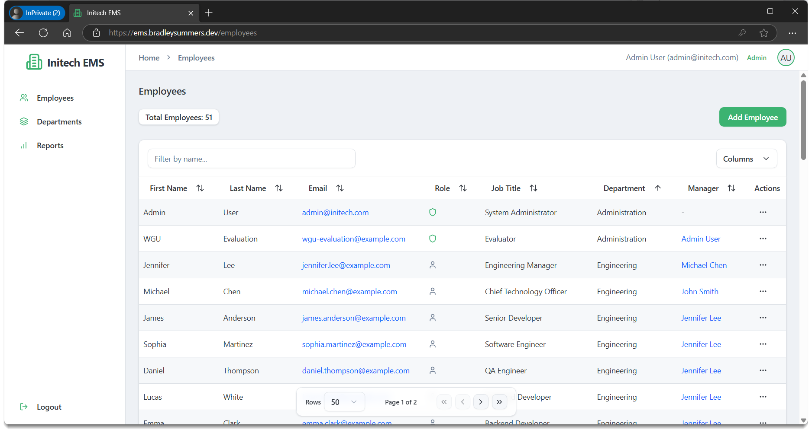

# Initech Employee Management System (EMS)

A full-stack web application for managing employees and departments with role-based access control.



- Frontend: [https://ems.bradleysummers.dev](https://ems.bradleysummers.dev)
- Backend API: [https://ems-backend-1-0-0-rc1.onrender.com](https://ems-backend-1-0-0-rc1.onrender.com)

## Features

- JWT-based authentication with role-based access control (ADMIN and EMPLOYEE roles)
- Employee management with hierarchical reporting structure
- Department organization
- Responsive UI with modern design
- Organizational chart visualization

## Tech Stack

- **Frontend**: React, TypeScript, Vite, Shadcn UI
- **Backend**: Java Spring Boot, Spring Security, JPA/Hibernate
- **Database**: PostgreSQL
- **Deployment**: Docker, Render.com, Neon.tech

## Local Development

### Prerequisites

- Java 21
- Node.js 18+
- PostgreSQL

### Backend

```bash
cd backend
# Set environment variables for database connection
./mvnw spring-boot:run
```

### Frontend

```bash
cd frontend
npm install
npm run dev
```

The application will be available at http://localhost:5173

## Deployment

### Backend (Docker)

```bash
cd backend
docker build -t ems-backend .
docker run -p 8080:8080 -e DATASOURCE_URL="..." -e DATASOURCE_USER="..." -e DATASOURCE_PASSWORD="..." -e FRONTEND_URL="..." ems-backend
```

### Backend (Render.com)

1. Deploy as a Web Service using Docker
2. Set required environment variables for database connection
3. Connect to your PostgreSQL database on Neon.tech

### Frontend (Render.com)

1. Build command: `npm install; npm run build`
2. Publish directory: `dist`
3. Add rewrite rule: `/* → /index.html`

### Database (Neon.tech)

Configure permissions:
```sql
GRANT ALL ON SCHEMA public TO your_username;
GRANT ALL PRIVILEGES ON ALL TABLES IN SCHEMA public TO your_username;
GRANT ALL PRIVILEGES ON ALL SEQUENCES IN SCHEMA public TO your_username;
```